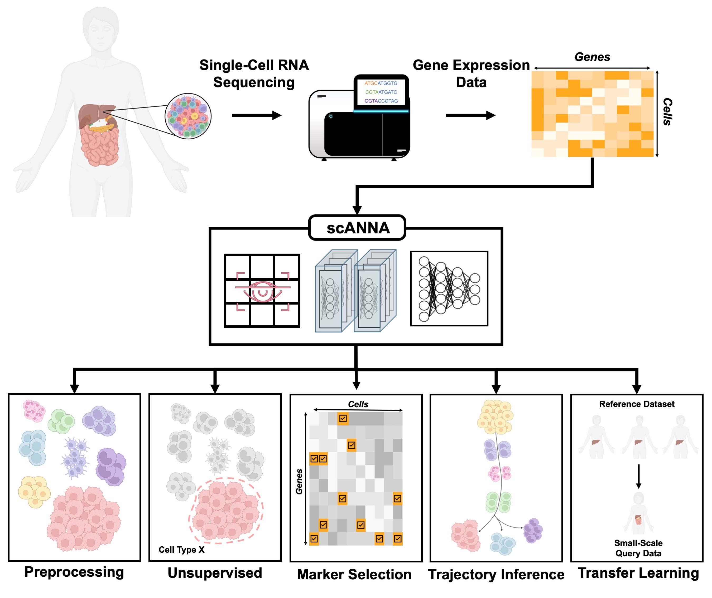

# scANNA (Package Repository)

[](https://doi.org/10.1101/2023.05.29.542760)

This repository hosts the package for [scANNA: single-cell ANalysis using Neural Attention](https://www.biorxiv.org/content/10.1101/2023.05.29.542760v1). To make package maintenance more efficient, and to provide more specific tutorials on using scANNA, we have located tutorials in a dedicated repository, as listed below.



## Installing scANNA
### Installing the GitHub Repository (Recommended)
scANNA requires ***Python 3.10*** and can be installed using PyPI:
```
$ pip install git+https://github.com/SindiLab/scANNA.git
```
or can be first cloned and then installed as the following:
```
$ git clone https://github.com/SindiLab/scANNA.git
$ pip install ./scANNA
```

### Install Package Locally with `pip`
Once the files are available, make sure to be in the same directory as `setup.py`. Then, using `pip`, run:

````bash
pip install -e .
````
In the case that you want to install the requirements explicitly, you can do so by:
````bash
pip install -r requirements.txt
````
Although the core requirements are listed directly in `setup.py`. Nonetheless, it is good to run this beforehand in case of any dependecies conflicts.

## Training scANNA
All main scripts for training (and finetuning) our deep learning model are located in the `training_and_finetuning_scripts` folder in this repository.

## [Tutorials](https://github.com/SindiLab/Tutorials/tree/main/scANNA)
We have compiled a set of notebooks as tutorials to showcase scANNA's capabilities and interptretability. These notebooks located [here](https://github.com/SindiLab/Tutorials/tree/main/scANNA). 

**Please feel free to open issues for any questions or requests for additional tutorials!**

## Trained Models
TODO: Will be released with the next preprint for scANNA.


## Citation
If you found our work useful for your ressearch, please cite our preprint:
```
@article {Davalos2023.05.29.542760,
	author = {Oscar A. Davalos and A. Ali Heydari and Elana J Fertig and Suzanne Sindi and Katrina K Hoyer},
	title = {Boosting Single-Cell RNA Sequencing Analysis with Simple Neural Attention},
	elocation-id = {2023.05.29.542760},
	year = {2023},
	doi = {10.1101/2023.05.29.542760},
	publisher = {Cold Spring Harbor Laboratory},
	URL = {https://www.biorxiv.org/content/early/2023/06/01/2023.05.29.542760},
	eprint = {https://www.biorxiv.org/content/early/2023/06/01/2023.05.29.542760.full.pdf},
	journal = {bioRxiv}
}
```
